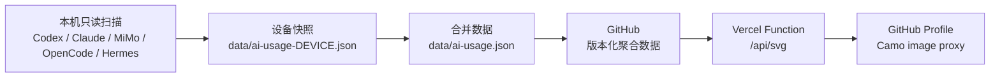

# AI Coding Blue Wall

[](https://github.com/ZONGRUICHD/codex-usage-bluewall-github/actions/workflows/ci.yml)
[](https://codex-usage-bluewall-github.vercel.app)

把本机 Codex、Claude Code、MiMo Code、OpenCode 与 Hermes 的聚合 token 用量，发布成适合 GitHub Profile 的蓝色活动墙。

- 线上预览：[codex-usage-bluewall-github.vercel.app](https://codex-usage-bluewall-github.vercel.app)
- SVG API：[codex-usage-bluewall-github.vercel.app/api/svg](https://codex-usage-bluewall-github.vercel.app/api/svg)
- 只提交按天聚合的数据，不提交提示词、源代码、对话或凭据

## 工作方式



GitHub Hosted Runner 和 Vercel 都无法读取你的本机 Codex 数据库，所以仓库内的定时 CI 只负责验证；真正的数据采集必须在有本地数据的设备上运行。

## Windows 一键更新

```powershell
git clone https://github.com/ZONGRUICHD/codex-usage-bluewall-github.git
cd codex-usage-bluewall-github

# 扫描本机 Codex、合并已有设备快照、测试、提交并推送
.\scripts\update.ps1 -Device windows-main -Commit -Push
```

更新器要求当前分支为 `main` 且工作树干净。扫描、合并、渲染和测试会先在系统临时目录完成；验证全部通过后才替换仓库文件，并以非交互方式推送 `HEAD:main`，所以中途失败不会留下半成品数据。

默认只扫描 Codex，避免与其他设备中已经收集的 Claude/MiMo 数据重复。需要指定工具时：

```powershell
.\scripts\update.ps1 -Tools codex,claude_code -Commit -Push
```

安装每天 00:15 及登录时自动运行的计划任务：

```powershell
.\scripts\install-windows-task.ps1 -RunNow
```

计划任务使用当前 Git 凭据直接推送 GitHub，不需要保存额外密码。卸载：

```powershell
.\scripts\install-windows-task.ps1 -Remove
```

## Token 统计规则

Codex 的 `cached_input_tokens` 是 `input_tokens` 的子集，`reasoning_output_tokens` 是 `output_tokens` 的子集。扫描器因此：

1. 优先采用事件中的权威 `total_tokens`；
2. 缺失时才回退为 `input_tokens + output_tokens`；
3. 保留 cache/reasoning 字段用于明细，但不会再次加进总量；
4. 累计计数器下降时按新片段处理，避免上下文压缩后丢失用量。

设备合并以 `device` 为身份。同一设备名只保留 `generated_at` 最新的快照；不同设备直接相加。
合并器会校验逐日总量、工具合计与 agent 合计完全一致。旧设备无法复核的 Codex 历史不会被估算成“精确值”，而是剔除并通过 `history gap` 明示；当前总量仍是所有已纳入数据的精确合计。

## Vercel 部署

项目现在是一个无依赖的静态状态页加根目录 `api/svg.js` Vercel Function，不再使用旧 Next.js 子项目。

1. 在 Vercel 导入本仓库；
2. Root Directory 保持仓库根目录；
3. `vercel.json` 会选择 `Other`，使用 Node.js 24 运行无 Python 的 API/SVG 验证，然后发布 `public/`；
4. `main` 每次推送会自动产生 Production Deployment。

无需环境变量。可选覆盖项：

| 变量 | 默认值 |
|---|---|
| `GITHUB_USERNAME` | `ZONGRUICHD` |
| `GITHUB_REPO` | `codex-usage-bluewall-github` |
| `GITHUB_BRANCH` | `main` |
| `TIME_ZONE` | `Asia/Shanghai` |
| `STALE_AFTER_DAYS` | `2` |

API 只接受 `GET` / `HEAD` 与可选的 `days=7..365`。它会比较 GitHub Raw 与部署包的 `generated_at` 并选取更新的有效快照；上游暂时失败时仍可使用部署包，避免 Profile 图片直接变成 500。

## 嵌入 GitHub Profile

```markdown
[](https://codex-usage-bluewall-github.vercel.app)
```

SVG 会显示同步日期、最后活动日期和过期状态；不再依赖不断变更的 `?v=` 缓存参数。

## 测试

```bash
npm run verify
```

测试覆盖 Codex 权威总量、计数器重置、跨设备账目校验、UTC+8 午夜边界、7/30/90/365 天布局、连续天数、过期提示、XML 转义、查询限制和 GitHub 读取失败降级。

## 关键文件

| 路径 | 用途 |
|---|---|
| `scripts/scan_all_tools.py` | 本地多工具只读扫描器 |
| `scripts/merge_devices.py` | 多设备快照合并 |
| `scripts/update.ps1` | Windows 扫描、测试、提交、推送 |
| `scripts/install-windows-task.ps1` | 安装/移除本机计划任务 |
| `api/svg.js` | 唯一 SVG 语义实现与 Vercel API |
| `scripts/render_blue_wall.js` | 调用同一实现生成静态 SVG |
| `public/index.html` | Vercel 状态页 |
| `.github/workflows/ci.yml` | 只读 CI 验证 |

维护细节见 [AI_HANDOFF.md](AI_HANDOFF.md)，部署细节见 [VERCEL_DEPLOY.md](VERCEL_DEPLOY.md)。

## License

MIT
