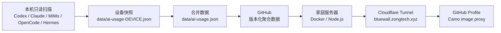

# AI Coding Blue Wall

[](https://github.com/ZONGRUICHD/codex-usage-bluewall-github/actions/workflows/ci.yml)
[](https://bluewall.zongtech.xyz)

把本机 Codex、Claude Code、MiMo Code、OpenCode 与 Hermes 的聚合 token 用量，发布成适合 GitHub Profile 的蓝色活动墙。

- 线上预览：[bluewall.zongtech.xyz](https://bluewall.zongtech.xyz)
- SVG API：[bluewall.zongtech.xyz/api/svg](https://bluewall.zongtech.xyz/api/svg)
- 只提交按天聚合的数据，不提交提示词、源代码、对话或凭据
- Vercel 站点在迁移观察期内保留为临时回滚，不再作为主入口

## 工作方式



GitHub Hosted Runner 与家庭服务器都无法读取 Windows 上的本机 Codex 数据库。仓库 CI 负责验证和部署，真正的数据采集仍必须在有本地数据的设备上运行。

## Windows 一键更新

```powershell
git clone https://github.com/ZONGRUICHD/codex-usage-bluewall-github.git
cd codex-usage-bluewall-github

# 扫描本机 Codex、合并已有设备快照、测试、提交并推送
.\scripts\update.ps1 -Device windows-main -Commit -Push
```

更新器要求当前分支为 `main` 且工作树干净。扫描、合并、渲染和测试会先在系统临时目录完成；验证全部通过后才替换仓库文件，并以非交互方式推送 `HEAD:main`，所以中途失败不会留下半成品数据。

默认只扫描 Codex，避免与其他设备中已经收集的 Claude/MiMo 数据重复。需要指定工具时：

```powershell
.\scripts\update.ps1 -Tools codex,claude_code -Commit -Push
```

安装每天 00:15 及登录时自动运行的计划任务：

```powershell
.\scripts\install-windows-task.ps1 -RunNow
```

计划任务使用当前 Git 凭据直接推送 GitHub，不保存家庭服务器密码或部署私钥。卸载：

```powershell
.\scripts\install-windows-task.ps1 -Remove
```

## Token 统计规则

Codex 的 `cached_input_tokens` 是 `input_tokens` 的子集，`reasoning_output_tokens` 是 `output_tokens` 的子集。扫描器因此：

1. 优先采用事件中的权威 `total_tokens`；
2. 缺失时才回退为 `input_tokens + output_tokens`；
3. 保留 cache/reasoning 字段用于明细，但不会再次加进总量；
4. 累计计数器下降时按新片段处理，避免上下文压缩后丢失用量。

设备合并以 `device` 为身份。同一设备名只保留 `generated_at` 最新的快照；不同设备直接相加。合并器会校验逐日总量、工具合计与 agent 合计完全一致。旧设备无法复核的 Codex 历史不会被估算成“精确值”，而是剔除并通过 `history gap` 明示；当前总量仍是所有已纳入数据的精确合计。

## 家庭服务器部署（主入口）

生产服务使用 Node.js 24 的独立 HTTP 服务器和 Docker 容器：

- 容器仅绑定主机回环地址 `127.0.0.1:13299`，不直接开放公网应用端口；
- Cloudflare Tunnel 将 `https://bluewall.zongtech.xyz` 转发到该回环端口；
- `main` 分支通过 CI 验证后，GitHub Actions 使用受限的强制命令 SSH 密钥部署指定 commit；
- `/healthz` 用于进程健康检查，`/readyz` 用于就绪检查；
- 镜像按 commit SHA 标记，部署失败会保留或恢复上一版本。

运行时无需秘密环境变量。可选覆盖项：

| 变量 | 默认值 |
|---|---|
| `GITHUB_USERNAME` | `ZONGRUICHD` |
| `GITHUB_REPO` | `codex-usage-bluewall-github` |
| `GITHUB_BRANCH` | `main` |
| `TIME_ZONE` | `Asia/Shanghai` |
| `STALE_AFTER_DAYS` | `2` |
| `DATA_CACHE_TTL_MS` | `300000`（进程内上游数据缓存与并发合并） |
| `HOST` | `0.0.0.0`（仅容器内；主机仍只发布到回环地址） |
| `PORT` | `3000` |

API 只接受 `GET` / `HEAD` 与可选的 `days=7..365`。它会比较 GitHub Raw 与镜像内置数据的 `generated_at` 并选取更新的有效快照；上游暂时失败时仍可使用镜像内置快照，避免 Profile 图片直接变成 500。

完整安装、密钥边界、Tunnel 配置、验证与回滚步骤见 [SELF_HOSTED_DEPLOY.md](SELF_HOSTED_DEPLOY.md)。

## Vercel 临时回滚

迁移观察期内继续保留 [原 Vercel 站点](https://codex-usage-bluewall-github.vercel.app) 及 Git 集成，用于家庭服务器或 Tunnel 故障时回滚。不要在主入口、GitHub Profile Camo 和连续数据更新全部验证前删除 Vercel 项目。旧平台的维护说明见 [VERCEL_DEPLOY.md](VERCEL_DEPLOY.md)。

## 嵌入 GitHub Profile

```markdown
[](https://bluewall.zongtech.xyz)
```

SVG 会显示同步日期、最后活动日期和过期状态；不再依赖不断变更的 `?v=` 缓存参数。

## 测试

```bash
npm run verify
```

测试覆盖 Codex 权威总量、计数器重置、跨设备账目校验、UTC+8 午夜边界、7/30/90/365 天布局、连续天数、过期提示、XML 转义、查询限制、独立 HTTP 服务器和 GitHub 读取失败降级。

## 关键文件

| 路径 | 用途 |
|---|---|
| `scripts/scan_all_tools.py` | 本地多工具只读扫描器 |
| `scripts/merge_devices.py` | 多设备快照合并 |
| `scripts/update.ps1` | Windows 扫描、测试、提交、推送 |
| `scripts/install-windows-task.ps1` | 安装/移除本机计划任务 |
| `api/svg.js` | 唯一 SVG 语义实现；兼容独立服务器与 Vercel 回滚 |
| `server.js` | 家庭服务器 HTTP 入口与健康检查 |
| `Dockerfile` | 生产容器镜像 |
| `deploy/` | 受限部署、回滚与 SSH 主机校验文件 |
| `scripts/render_blue_wall.js` | 调用同一实现生成静态 SVG |
| `public/index.html` | 状态页 |
| `.github/workflows/ci.yml` | CI 验证与主分支部署 |

维护细节见 [AI_HANDOFF.md](AI_HANDOFF.md)。

## License

MIT
